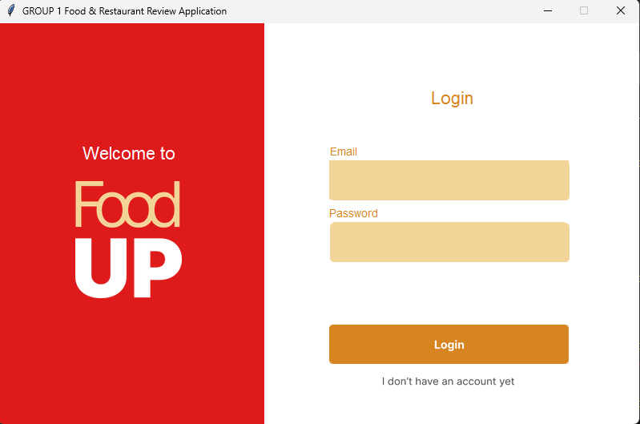
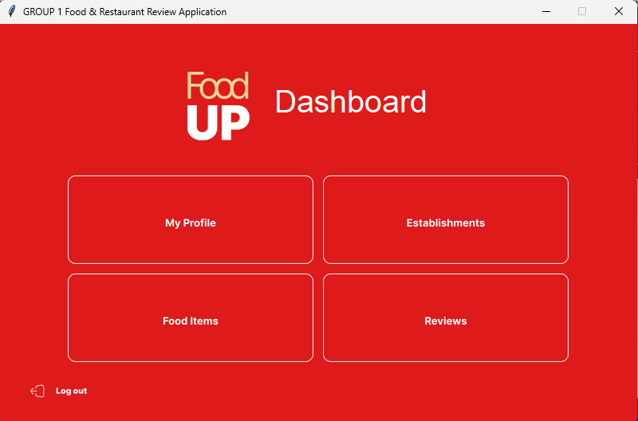
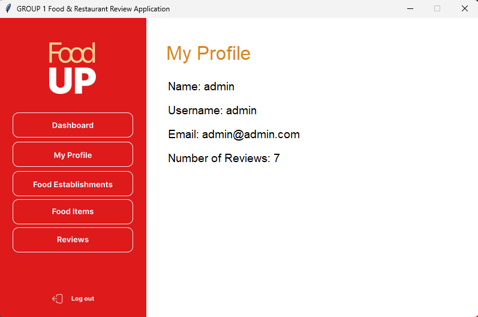

# Food UP
Food &amp; Restaurant Review Application using Python. A project in CMSC 127.

## Authors
CMSC 127 ST-1L GROUP 1  
De Castro, John Nico T.  
Olano, Kenneth O.  
Ramos, John Miles  
Tandang, Bernard Jezua R.  

## Installation & Usage
Follow these steps to set up the project locally:

1. Clone the repository:

       git clone https://github.com/bernardjezua/CMSC127Proj.git

2. Install Python

       https://www.python.org/downloads/

4. Navigate to the project directory and install dependencies:

       pip install -r dependencies.txt

5. Inside the project directory, login to mariadb using your sql root account and run the source command:

       mariadb -uroot -p<root_password>
       source restaurant.sql

6. Run the program:

       python main.py

7. You will be greeted with a login page, login or signup for an account

## Screenshots

Dashboard  

Profile  
